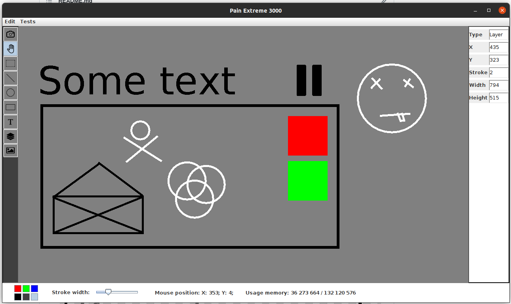

# Paint
GUI java app for drawing simple graphic elements, such: Line, Circle, Oval, Rectangle, Text, Arrows, etc.
With the ability to manipulate and change their properties.  

## Interface screenshot
